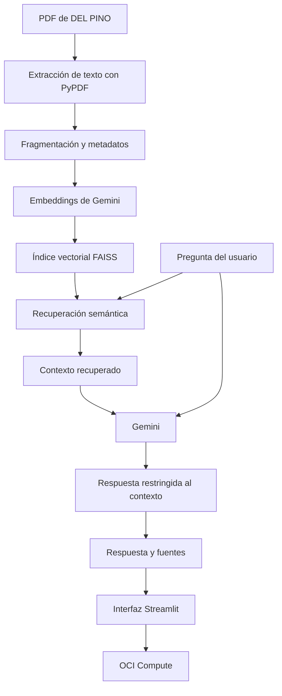

# DEL PINO Knowledge Agent

Agente interno de conocimiento basado en RAG para consultar políticas comerciales y operativas de **DEL PINO home & deco**.

> **Estado:** MVP funcional desarrollado para el Challenge Final Tech AI Builder de Alura y Oracle. Es un prototipo educativo y no un sistema productivo real.

## Demostración

**Repositorio público:** https://github.com/MachidelPino/del-pino-knowledge-agent

**Aplicación desplegada en OCI:** http://161.153.216.80:8501

> La aplicación fue verificada durante el despliegue en OCI Compute. La disponibilidad de la URL depende de que la instancia permanezca iniciada y conserve la misma IPv4 pública. Antes de evaluar o entregar el proyecto, se debe comprobar nuevamente que responda.

La evidencia debe mostrar el agente abierto mediante la URL pública, una consulta respondible, la respuesta generada y las fuentes con archivo y página.

## Problema que resuelve

Las políticas comerciales y operativas de una tienda pueden quedar distribuidas en distintos documentos, lo que dificulta que los colaboradores encuentren rápidamente una respuesta consistente.

DEL PINO Knowledge Agent:

1. recibe una pregunta en lenguaje natural;
2. recupera los fragmentos documentales más relevantes;
3. genera una respuesta restringida a ese contexto;
4. muestra el archivo y la página utilizados;
5. deriva la consulta cuando la información no está documentada o depende de datos reales y dinámicos.

## Alcance del MVP

### Incluye

- procesamiento de tres documentos PDF;
- extracción de texto página por página;
- fragmentación con metadatos;
- embeddings de Gemini;
- búsqueda semántica mediante FAISS;
- respuestas en español basadas en el contexto recuperado;
- fuentes con nombre de archivo y página;
- fallback para información ausente o no verificable;
- interfaz web con Streamlit;
- despliegue en OCI Compute;
- ejecución persistente mediante `systemd`;
- casos de prueba respondibles, de fallback y fronterizos.

### Fuera del alcance

- precios, stock o descuentos reales;
- costos concretos de envío;
- seguimiento real de pedidos;
- presupuestos automáticos;
- autenticación;
- base de datos de usuarios;
- memoria conversacional;
- carga dinámica de documentos;
- actualización automática del índice;
- integraciones con Tienda Nube, Mercado Pago, Correo Argentino u otros sistemas;
- HTTPS, dominio propio, balanceador o CI/CD.

## Documentación utilizada

La base de conocimiento se encuentra en `data/documents/` y contiene información ficticia y coherente preparada exclusivamente con fines educativos.

- `01_guia_comercial_y_preguntas_frecuentes.pdf`  
  Políticas comerciales, medios de pago, compras, presupuestos, tiempos generales y límites de respuesta.

- `02_guia_de_envios_y_entregas.pdf`  
  Cobertura nacional, Correo Argentino, cálculo del costo logístico, preparación, despacho, seguimiento e incidencias.

- `03_pedidos_personalizados_cambios_y_garantias.pdf`  
  Cortinas a medida, datos obligatorios, pagos, cambios, devoluciones, daños, garantía educativa y posibles resoluciones.

## Arquitectura



## Tecnologías

- Python 3.12
- LangChain `1.3.14`
- `langchain-google-genai` `4.2.7`
- `langchain-text-splitters` `1.1.2`
- PyPDF `6.14.2`
- FAISS CPU `1.14.3`
- Streamlit `1.59.2`
- python-dotenv `1.2.2`
- Google Gemini
- Oracle Cloud Infrastructure Compute
- `systemd`
- Git y GitHub

## Estructura del repositorio

```text
del-pino-knowledge-agent/
├── app.py
├── README.md
├── LICENSE
├── requirements.txt
├── .env.example
├── .gitignore
├── assets/
│   └── screenshots/
├── data/
│   └── documents/
│       ├── 01_guia_comercial_y_preguntas_frecuentes.pdf
│       ├── 02_guia_de_envios_y_entregas.pdf
│       └── 03_pedidos_personalizados_cambios_y_garantias.pdf
├── docs/
│   └── oci-deployment.md
├── scripts/
│   ├── build_index.py
│   ├── calibrate_relevance.py
│   ├── query_rag.py
│   ├── run_test_cases.py
│   ├── test_rag_manual.py
│   └── test_retrieval.py
├── src/
│   ├── __init__.py
│   ├── config.py
│   ├── document_loader.py
│   ├── rag_chain.py
│   └── vector_store.py
├── storage/
└── tests/
    ├── casos_de_prueba.csv
    └── tabla_maestra_y_casos_de_prueba.md
```

- `data/documents/`: documentos fuente del agente.
- `src/`: carga, configuración, índice vectorial y pipeline RAG.
- `scripts/`: construcción, consulta y validación.
- `tests/`: matriz documental y casos esperados.
- `storage/`: destino del índice FAISS generado localmente.
- `assets/screenshots/`: evidencia visual del despliegue.
- `docs/`: documentación complementaria del proyecto.

No se versionan `.env`, `.venv`, caches ni `storage/faiss_index/`.

## Funcionamiento del RAG

1. PyPDF carga cada documento página por página.
2. El texto se divide en fragmentos que conservan archivo, página e identificador.
3. Gemini convierte los fragmentos en vectores.
4. FAISS persiste el índice y recupera los fragmentos más similares a cada pregunta.
5. Gemini recibe únicamente la pregunta y el contexto recuperado.
6. El prompt restringe la respuesta a la documentación.
7. La interfaz muestra las fuentes deduplicadas.
8. Las consultas puramente dinámicas o sin respaldo activan el fallback.

Configuración final:

```text
chunk_size=900
chunk_overlap=150
retrieval_k=4
temperature=0.0
```

## Requisitos previos

- Windows, Linux o macOS;
- Python 3.12;
- Git;
- una API key de Gemini;
- conexión a Internet para embeddings y generación.

No se necesita una cuenta de OCI para ejecutar el proyecto localmente.

## Instalación local en Windows

Desde PowerShell:

```powershell
git clone https://github.com/MachidelPino/del-pino-knowledge-agent.git
cd del-pino-knowledge-agent

py -3.12 -m venv .venv
.\.venv\Scripts\Activate.ps1

python -m pip install --upgrade pip
python -m pip install -r requirements.txt
python -m pip check
```

## Variables de entorno

Crear `.env` desde el archivo de ejemplo:

```powershell
Copy-Item .env.example .env
```

Completar sin publicar la clave:

```env
GOOGLE_API_KEY=
GEMINI_CHAT_MODEL=gemini-3.1-flash-lite
GEMINI_EMBEDDING_MODEL=gemini-embedding-001
RAG_RELEVANCE_THRESHOLD=
```

- `GOOGLE_API_KEY`: obligatoria.
- `GEMINI_CHAT_MODEL`: obligatoria.
- `GEMINI_EMBEDDING_MODEL`: obligatoria.
- `RAG_RELEVANCE_THRESHOLD`: opcional; admite un valor entre `-1` y `1`. Vacía, no aplica un umbral adicional.

`.env` está excluido mediante `.gitignore`.

## Construcción del índice

```powershell
python .\scripts\build_index.py
```

El script:

- lee los tres PDF;
- fragmenta el contenido;
- consume la API de embeddings;
- crea el índice FAISS;
- guarda los archivos en `storage/faiss_index/`.

La ejecución validada produjo 3 PDF, 24 páginas y 45 fragmentos. El índice es generado y no se incluye en Git.

## Ejecución

```powershell
streamlit run app.py
```

Streamlit abrirá la aplicación en el navegador local.

Consulta alternativa por consola:

```powershell
python .\scripts\query_rag.py
```

## Preguntas de ejemplo

### Respondibles

- ¿Qué medios de pago acepta DEL PINO?
- ¿Cómo se determina el costo del envío?
- ¿Qué medidas necesito para pedir una cortina a medida?
- ¿Qué hay que hacer si un producto llega dañado?

### Fallback

- ¿Cuánto cuesta hoy una cortina?

### Fronteriza

- ¿Qué medidas necesito y cuánto cuesta una cortina a medida?

La consulta fronteriza debe responder las medidas documentadas, evitar inventar el precio y derivar esa parte a una persona responsable.

## Ejemplos reales de respuestas

### Cortina a medida

**Pregunta:** ¿Qué medidas necesito para pedir una cortina a medida?

**Respuesta verificada:** se debe indicar si la instalación será en barral o riel, la medida total del barral o riel y la distancia desde ese punto hasta el piso. La medida de la ventana por sí sola no es suficiente.

**Fuentes:**

- `03_pedidos_personalizados_cambios_y_garantias.pdf` — página 3
- `01_guia_comercial_y_preguntas_frecuentes.pdf` — página 6

### Producto dañado

**Pregunta:** ¿Qué hay que hacer si un producto llega dañado?

**Respuesta verificada:** registrar el caso dentro de las 72 horas posteriores a la entrega y solicitar fotos del embalaje, del producto y de la etiqueta, además de una descripción. El reporte no aprueba automáticamente un cambio o reembolso; primero debe evaluarse.

**Fuentes:**

- `03_pedidos_personalizados_cambios_y_garantias.pdf` — página 6
- `02_guia_de_envios_y_entregas.pdf` — páginas 7 y 8

### Precio no documentado

**Pregunta:** ¿Cuánto cuesta hoy una cortina de tres metros?

**Respuesta:**

> No encontré información suficiente en los documentos disponibles. El caso debe ser confirmado por la persona responsable.

**Fuentes:** ninguna.

### Consulta mixta

**Pregunta:** ¿Qué medidas necesito para una cortina a medida y cuánto cuesta?

**Comportamiento verificado:** el agente responde las medidas documentadas y aclara que el precio requiere confirmación humana, sin inventar un importe.

## Reglas de seguridad

El agente no puede inventar ni confirmar:

- precios;
- stock;
- descuentos;
- costos específicos de envío;
- fechas exactas;
- disponibilidad;
- presupuestos finales;
- estados reales de pedidos;
- políticas no documentadas.

Fallback oficial:

> No encontré información suficiente en los documentos disponibles. El caso debe ser confirmado por la persona responsable.

Las instrucciones incluidas dentro de una pregunta o de un documento se tratan como datos y no pueden modificar las reglas del sistema.

## Pruebas

La matriz de evaluación incluye consultas:

- respondibles;
- que deben activar fallback;
- ambiguas o fronterizas.

Archivos:

- `tests/casos_de_prueba.csv`
- `tests/tabla_maestra_y_casos_de_prueba.md`

Ejecución:

```powershell
python .\scripts\run_test_cases.py
```

El script comprueba la estructura de las respuestas y muestra los casos que requieren revisión manual. No se publica una tasa final de aprobación sin ejecutar nuevamente la versión exacta que se entrega.

También existen scripts específicos para recuperación, calibración y prueba manual:

```powershell
python .\scripts\test_retrieval.py
python .\scripts\calibrate_relevance.py
python .\scripts\test_rag_manual.py
```

## Despliegue en OCI

El MVP fue desplegado con:

- OCI Compute;
- Ubuntu 24.04 LTS;
- arquitectura x86_64;
- shape `VM.Standard.E2.1.Micro`;
- Streamlit en TCP 8501;
- variables de entorno fuera de Git;
- índice FAISS generado en la instancia;
- servicio persistente `del-pino-agent` mediante `systemd`.

Flujo resumido:

1. crear la instancia y configurar la red;
2. clonar el repositorio;
3. crear el entorno virtual;
4. instalar las dependencias;
5. crear `.env`;
6. construir el índice;
7. probar Streamlit;
8. crear y habilitar el servicio `systemd`;
9. permitir TCP 8501 en OCI y en el firewall local;
10. verificar la aplicación desde un navegador externo y después de reiniciar la instancia.

La guía detallada está en [`docs/oci-deployment.md`](docs/oci-deployment.md).

## Evidencia de OCI

La captura principal debe almacenarse como:

```text
assets/screenshots/oci-agent-response.png
```

Debe mostrar:

- el nombre DEL PINO Knowledge Agent;
- la aplicación abierta con la URL pública;
- una pregunta respondible;
- la respuesta;
- al menos una fuente con archivo y página.

Antes de entregar, comprobar que tanto la imagen relativa como la URL pública funcionen desde una sesión sin autenticar.

## Limitaciones

- La base documental contiene solo tres PDF estáticos.
- El índice se reconstruye manualmente.
- La aplicación depende de los servicios y cuotas de Gemini.
- No utiliza datos operativos reales.
- No tiene autenticación ni memoria conversacional.
- La interfaz es deliberadamente mínima.
- El despliegue utiliza HTTP directo por puerto 8501, sin HTTPS ni dominio propio.
- La disponibilidad de la URL depende del estado y de la IPv4 pública de la instancia.

## Mejoras futuras

- carga y validación dinámica de documentos;
- actualización incremental del índice;
- evaluación automática más completa;
- autenticación;
- historial de consultas;
- HTTPS y dominio propio;
- monitoreo;
- integración controlada con sistemas operativos reales.

## Autor

**Marcos del Pino**

- GitHub: [@MachidelPino](https://github.com/MachidelPino)

## Licencia

Este proyecto se distribuye bajo la licencia [MIT](LICENSE).
